

# Probability of Default

### :brazil: [Versão em Português](https://github.com/FelipeLRoll/previsao-inadimplencia/blob/main/readmePortugues.md)
### Inspired by: [Default Rate](https://www.youtube.com/watch?v=ey4GZtO_VzE&t=0s)

# Project Overview
  - ## **Motivation:**
  Default is a critical problem for financial institutions, as it directly impacts the cash flow and financial health of companies. Predicting in advance which customers are most likely to default allows companies to adopt  preventive strategies, minimizing losses.

 - ## **Objectives:**

This project's **main objective** is to build a Machine Learning model that is capable of predicting customer default based on a set of financing contract data.

- **Build a predictive default model** using classification algorithms.
- **Analyze the most relevant variables** to predict default, helping to understand risk factors.
- **Evaluate the performance of models** using performance metrics.

- ## **Data Dictionary:**
| Column | Description |
|-------------------------------|----------------------------------------------------|
| **CONTRACT_NUMBER** | Contract identification number |
| **CONTRACT_SIGNING_DATE** | Date the contract was signed |
| **FINANCING_TYPE** | Type of financing offered |
| **YEAR_RATE** | Annual interest rate of the contract |
| **FINANCING_PZ** | Financing term (in months) |
| **CUSTOMER_CITY** | City where the customer lives |
| **CLIENT_STATE** | State where the customer lives |
| **CLIENT_MONTHLY_INCOME** | Customer's monthly income |
| **QT_PC_LATE** | Number of overdue installments |
| **QT_DIAS_PRIM_PC_ATRASO** | Number of days the first installment is overdue |
| **QT_TOTAL_PC_PAYMENTS** | Total number of installments paid |
| **VL_TOTAL_PC_PAGAS** | Total amount of installments paid |
| **QT_PC_PAGAS_ON_DAY** | Number of installments paid on time |
| **QT_DIAS_MIN_ATRASO** | Lowest number of days in arrears |
| **QT_DIAS_MAX_ATRASO** | Highest amount

# Key Features:
- **Type of problem**: *Classification*
- **Target Column**: *INADIMPLENTE_COBRANCA*
- **Process**: Data exploration, treatment, feature engineering, model training, evaluation, and tuning

# Tools & Resources Used:
- **Development Tools**: `Jupyter Notebook, Git, GitHub, Visual Studio Code`
- **Project Management**: `Poetry`
- **Programming Language**: `Python ^3.13`
- **Libraries**:
  - `pandas = ^2.2.3`
  - `pypyodbc = ^1.3.6`
  - `python-dotenv = ^1.0.1`
  - `plotly-express = ^0.4.1`
  - `nbformat = ^5.10.4`
  - `kaleido = 0.1.0.post1`
  - `scikit-learn = ^1.5.2`
  - `imbalanced-learn = ^0.12.4`
  - `xgboost = ^2.1.2`
  - `joblib = ^1.4.2`
  - `openpyxl = ^3.1.5`

 
# Project Steps:
  * ## Data Creation
    - This step consists of creating the database structure to extract the data from the ERP system and inserting the data into another database through an automatic ETL process. We will also create tables and procedures in our database.

  * ## Loading data
    - We use the **pypyodbc** library to connect to the database and retrieve the data.
    
  * ## Exploratory Data Analysis
     - Here we take a look at our dataset, to understand the structure and patterns. Some insights found in this process:
       
        - We see that the dataset has **10415 lines and 20 columns**;
        - The average number of overdue installments is much higher when the client has a monthly income of more than **R$ 5,800**;
        - The average installment amount per customer's monthly income is much higher when the customer earns **$1,800 or less**, or when the customer earns **$6,800 or more**;
        - Customers from **525 different cities**;
        - Clients from **all** states in Brazil;
        - Most of the clients in this dataset are in default (8038 out of 10415, ~77%)**;
        - Data period from: **2012-01-10 to 2022-11-14**;
        - The majority of customers (**41%**) earn between **R$ 6,900 and R$ 7,800 per month**;
        - **34%** of customers earn up to **R$ 1,800**;
        - **75%** of customers either receive between **R$ 6,900 and R$ 7,800 or up to R$ 1,800**;
        - **76%** of the installments paid are paid on time.

  * ## Data Treatment
    - This step focused on cleaning and preprocessing the data, we also optimized the columns to reduce the size of the dataset. This step had some of the following treatments:
      
      -  Ordering some columns to give a sense of increased importance to the different types of values;
      -  Removal duplicate lines;
      -  Grouping values and creating intervals to reduce cardinality;
      -  Removal os some columns not relevant for the analysis.

    - In this step we also had a few more insights:
     
      - The median **Annual Rate** is **17.27%**.
      - Average **Financing Term** is **114** while the median is **72**. The jump from 25% of the data to 50% of the data doesn't exist, but from 50% to 75% it goes from **72** to **180**. The standard deviation is also high, which indicates a greater dispersion of the data.
      - Something similar occurs with the other columns in the Dataset, where most of the values are concentrated in a small range of values.
      - Most of the clients are from **Brasília**.
      - The range of **Total Amount of Installments Paid** that appears the most is **R$ 8,676 to R$ 25,000**.
      - The **Financing Amount** range that appears the most is **Up to R$ 210,000**.
      - The **Partment Value** range that appears the most is **Up to R$ 2,500**.	
     

  * ## Visualization with *Plotly Express*
    - Here many charts were made to better visualize our data and help us understand it better
   
    ### **Distribution of Clients per Income**
    
    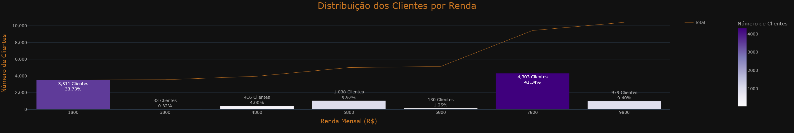
    - The highest concentration of clients is in the **R$ 7,800** range, followed by **R$ 1,800**.

    ### **Distribution of Age group per Income**

    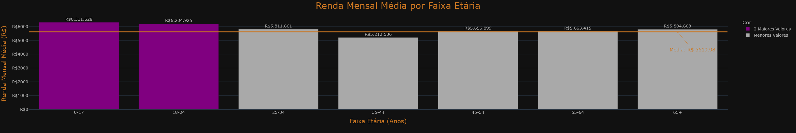
    - The highest average monthly income is between **0-24 years**

    ### **Number of Average Days in Arrears by Financing Range**
    
    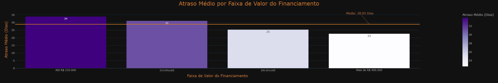
    - Here we can see which Loan Value Range tends to have the highest average arrears, in this case the range up to R$ 210,000 has the highest average.
   
    ### **Age Range at Contract Signing by Financing Period**

    
    - Between **0-24 years** there is a visible density around terms of 50 to 100 months, suggesting that although some have long terms, the majority of customers focus on medium terms of financing.
    
    - Customers aged **over 25** have a density concentrated between 50 and 100 months, with much less variability compared to the **0-24** age groups.
    
    - In the **25+** age group there are fewer outliers, which indicates fewer extreme cases of very long or short financing.
    
    - For the **65+** group, the financing term distribution is even narrower and more centered, which may indicate that older customers have more predictable financing options or are more cautious when choosing shorter terms.
    
    - As age increases, financing terms become more standardized and centered between **50 and 100 months**.
   
    ### **Distribution of Maximum Delays per Income**

    
    - For most income brackets, there is a wide variation in arrears. Arrears range from **0 to over 3000 days**.

    - The majority of customers in all income brackets tend to have shorter arrears, close to **0 days**. This means that, although some customers have long arrears, the majority manage to maintain shorter arrears.
    
    - Some income brackets have longer tails, reaching extreme arrears of more than **5000 days**.
    
    - There are some outliers spread across all income bands, with some extreme cases of delays far beyond what most customers experience.
   
- Some other insights found in the other charts present in this project:
  
    - Loans **up to R$ 210,000** are concentrated in the lower installment values **(less than R$ 2,500)**.
      
    - Loans **from R$210,000 to R$290,000** show greater variability in installment values, with a wider box and *whiskers*, indicating greater dispersion in installment values.
      
    - Loans **from R$ 290,000 to R$ 400,000** have most installment values **up to R$ 5,000**, with some going beyond this range.
      
    - The graph shows even more variability in the installments, with higher median values. There are also some outliers, but the range of payments here extends to higher installment values.
      
    - As the **financing amount increases**, the **monthly installments tend to increase**, and the dispersion of the values also becomes greater.
      
    - The average **interest rate** increases as the **financing amount** increases.
      
    - For the **48 month** financing period, the average interest rate is the highest, at around **20% per year**.
      
    - For terms **between 160 and 194 months**, the average interest rate drops a little, to around **14-17%** per year. These intermediate terms seem to be the most favorable in terms of interest rates.
      
    - Longer terms, **between 200 and 240 months**, see rates rise again, reaching **20%**.
      
    - Shorter or very long terms are associated with higher interest rates, while intermediate terms offer the best conditions.
    
    - Most customers are in the states of **São Paulo, Goias and the Federal District**.
    
    - 31.7% of the installments are in arrears, with a total of 173,754 installments.
      
    - This figure seems quite high when compared to data from 2021 in Brazil, in real estate financing, which reached 20%.
    
    **SOURCE:**
    
    **Funds Expand Purchase of Overdue Real Estate Loans in Brazil**
    
    https://www.infomoney.com.br/onde-investir/fundos-ampliam-compra-de-credito-imobiliario-em-atraso-no-brasil/
    
    Date accessed: 22/10/2024
        
* ## Exploratory Data Analysis with Categorical Columns
  
    - Here we take a closer look to Categorical Columns, creating histograms to visualize patterns and how they behave.

    ### **Categorical Columns per Default**
  
    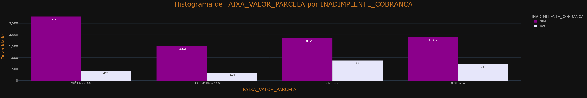

    

    

- Some insights found in the other charts:
  
  - Location

    - **Value distribution**: The majority of customers are in Brasilia, Goiania and São Paulo.
    * **Default**: There are few places where the number of defaulters is lower than non-defaulters, usually in **small towns** with few cases available.

  - Age group
      
      * **Distribution of cases**: The majority of cases are in the **25-54 age group** on the date the contract was signed.
      * **Default: **All ranges** have more defaulters than the opposite.
      
  - Total Installments Paid
      
      * **Most common range**: When the total number of installments paid is greater than R$47,000, we see a higher concentration of customers.
      * **Default Trend**: Up to **R$ 8,675** the number of defaulters is **smaller** than non-defaulters, as the value **increases**, **the proportion of defaulters grows**.
      
  - Financing amount
      
       * **Distribution of financing**: The financing value ranges are well distributed, with a greater concentration in the lower range of **up to R$ 210,000**.
       * **Default Comparison**: The **larger the loan**, the **greater the proportion of defaulters**.
       
  - Installments Value
      
       * **Distribution of the installment**: The range with a higher concentration is **up to R$ 2,500**.
       * **Default Comparison**: The more extreme values of **up to R$ 2,500** and **over R$ 5,000** have a **lower proportion** of non-defaulters, with a **higher proportion** in the middle range.
      
  - Number of defaulters
      
       * Default: Around 80% of customers are in default.
         
 * ## Exploratory Data Analysis with Numerical Columns
   
    - The Objective here is to observe correlation between Numerical Columns and the Target Column.
      
   ### **Numeric Columns per Default**

    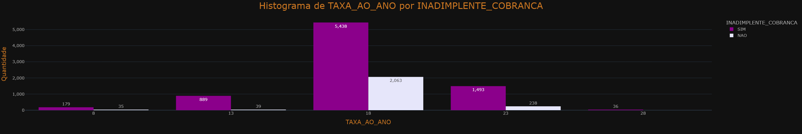

    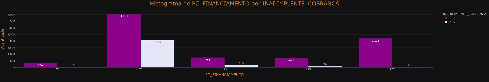

    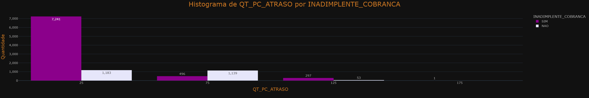

- Some insights found in the other charts:
  
  - Monthly Income

    * Income distribution: The majority of customers are in **up to R$ 1,800** and **R$ 6,000 to R$ 8,000**.
    * Default rates: In all income brackets, the number of defaulters exceeds the number of non-defaulters.
    * Default Trend: Customers with a monthly income of **up to R$ 4,000** have a significantly higher tendency to be in default compared to those in higher income brackets.

  - Annual Rate

    * **Annual Fee Distribution**: The majority of customers pay an annual fee within the **15-20%** range, making this range the most important for analysis.
    * **Default Rates by Annual Rate**: In all annual rate bands, the number of defaulters exceeds that of non-defaulters.

  - Financing Term

    * **Most Common Financing Term**: The most common financing term is **50-99 days**.
    * **Default Trend**: There is a trend where, **after 99 days of financing, the difference between defaulting and non-defaulting customers increases**.

  - Arrears

    * **Distribution of Arrears**: In all the graphs related to arrears, the concentration of customers is in the **first interval** and **decreases gradually** as the intervals progress.
    * **Delinquency Comparison**: With a few exceptions, mainly in Days of First Delinquency, the number of delinquent customers is always higher than the number of non-defaulting customers.

   ### **Correlation**

   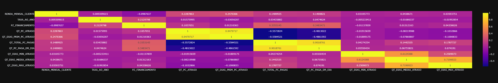

	 * **Financing Term and Installments Paid**: The Financing Term shows an average positive correlation with:
		  + Total Installments Paid
		  + Installments paid on time
  
   * **Installments as a Correlation Factor**: Most of the strong correlations occur through the columns involving the **installments**.

	 * **Monthly Income and Installment Payments**: The customer's Monthly Income also shows an average correlation with:
		  + Total Installments Paid
		  + Installments Paid on Time

   * **Annual Rate and Financing Term**: The Annual Percentage Rate has an average correlation with:
  		+ Financing Term
  		
   * **Negative correlation between arrears and payments**: There is a strong negative correlation between:
  		+ Number of Overdue Installments
  		+ Number of Days First Installment Overdue
  		e:
  		+ Total Installments Paid
  		+ Installments paid on time
  
 * ## OneHotEncoding

   - Here we separate our numerical, categorical and target columns to use **LabelEncoder** since we have high cardinality in some columns.

 * ## Balacing the Target Column
   
    - This step splits the data in the Target Column and the rest of the dataset, creating two datasets in order to balance out the Target Column using *SMOTE*, this help the machine learning model to not be biased towards one of the possible results.

    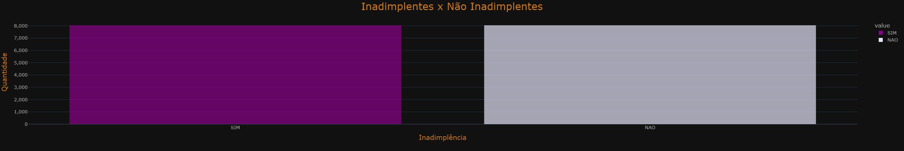

 * ## Scaling the data 
    - Here we test Standardization and the *RobustScaler* in order to put our numerical values in the same scale and not create a bias for our model. After testing with all methods, we chose to use *Standardization* because it had the best results. We also split the data in *train* and *test*
  
 * ## Model Creation, Hyperparameter Tunning, Training and Evaluation
   - This step creates out Machine Learning Models that are going to be trained with our data, hyperparameters are also manualy assigned here. The models used are *Random Forest Classifier*, *Support Vector Machine*, *K Neighbors Classifier*, *XGBoost* and *Logistic Regression*. We tested the **Accuracy**, **Best Hyperparameters**, **Training Time(in seconds)** and **Number of Total Trainings Made** for each of our models, having *XGBoost* as the best model with an accuracy of ~92.00%.
  
# Results:
Predicted results can be found in **`excel/resultado.xlsx`**.  

- **Random Forest**:
  
  
  
- **SVM**:
  
  

- **KNN**:
  
  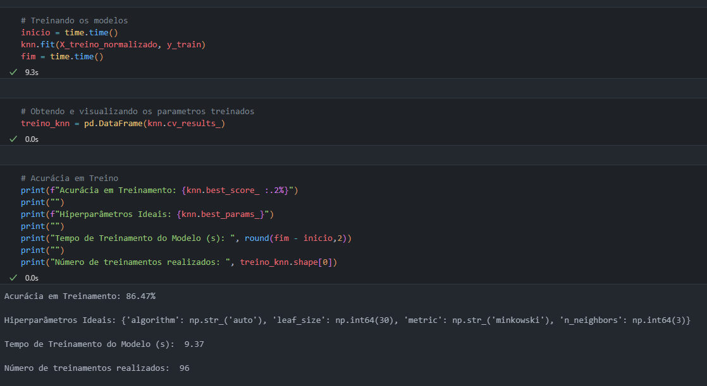

- **XGBoost**:
  
  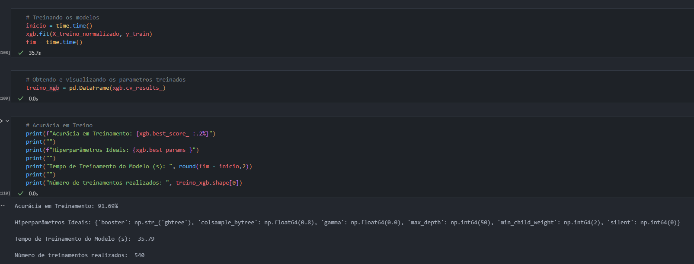  

- **Logistic Regression**:
  
  

- **Overall Results**:
  
  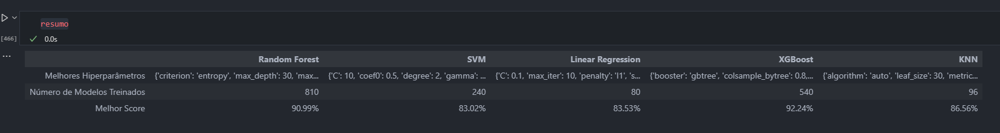

- **Feature Importance**:
  
  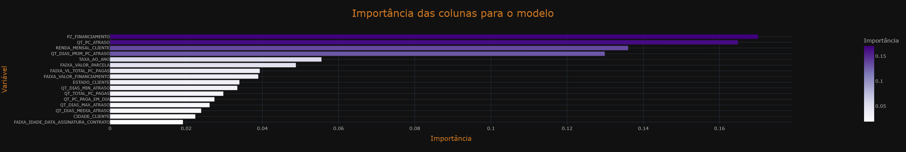

- **Final Model (XGBoost with best Hyperparameters)**
   
  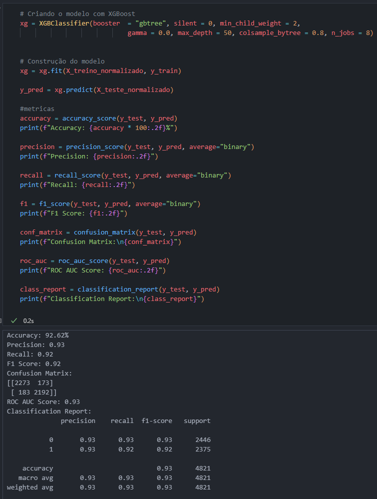

- Metrics:
  
  - **Accuracy: 92.62%:** Approximately **92%** of the predictions made by the model are correct.

  - **Accuracy: 0.93:** Of all the predictions that the model identified as positive, 92% were actually positive. A **high accuracy** indicates a **low rate** of false positives.
  
  - **Recall: 0.92:** Of all the real positive cases, the model correctly identified **92%** of them. A high recall means a **low rate** of false negatives.
  
  - **F1 Score: 0.92:** The harmonic mean of precision and recall. A high F1 Score indicates a **good balance** between precision and recall.
  
  - **Confusion Matrix:** 
      - True Negatives (2241):** Correctly identified negative cases.
      - **False Positives (189):** Positive cases incorrectly identified.
      - **False Negatives (197):** Negative cases incorrectly identified.
      - True Positives (2194):** Positive cases correctly identified. This shows that both false positives and false negatives are **relatively low**, indicating **good performance**.
      
  - **ROC AUC Score: 0.92:** Area under the ROC curve. A score of **0.92** indicates that the model does a **good job** of distinguishing between positive and negative classes.

  - **Classification:**
    - **Class 0 and Class 1:** Both classes have high precision, recall and F1 scores, showing balanced performance in different categories.
    - Macro Average:** Average precision, recall and F1 scores equally between the classes.
    - Weighted Average:** Takes into account the unbalance of the classes when averaging precision, recall and F1 scores.
   
# PRESCRIPTIVE ANALYSIS

Some measures can be taken to minimize the number of defaulting customers:

1. **Customer segmentation**

    - Using clustering algorithms to group customers based on risk factors (e.g. income, credit history, payment behaviour) can help personalize interventions, such as offering flexible payment plans or adjusted interest rates for high-risk groups.
    - For these customers, it would be interesting to build an alert system that is activated when they show early signs of financial difficulties, such as late payments.

2. **Behavioral and Temporal Analysis**

    - Another alternative would be to analyze payment histories over time to detect trends. Identifying these patterns can help plan interventions, such as targeted reminders during periods of greatest risk.

3. **Policy Adjustments Based on Risk Profiles**

    - For contracts with a predicted high probability of default, policies could be defined such as lower financing rates, shorter loan terms or a stricter approval process.
    - Offer prices based on different customer groups, adjusting interest rates based on the probability of default.      

4. **Customer Education and Engagement Programs**

    - Programs to educate customers about financial management and budgeting can be a good alternative, especially for those in high-risk segments. This can reduce the risk of default by improving financial decision-making.
    - Reminders and tips via notifications or emails to encourage punctual payments.

# Conclusion

In this project, an analysis was developed to **predict the probability of customer default** based on a set of loan data. The main stages of the project included:

1. **Attribute Engineering and Data Preparation**: We carried out a complete pre-processing of the data, including the creation of new variables and the **balancing of the target variable** to ensure better model performance.

2. **Exploratory Data Analysis (EDA)**: We used visualizations and descriptive statistics to **identify patterns and understand the distribution of the variables**, which helped guide the subsequent modeling steps.

3. **Modeling**: Different **classification algorithms** were tested, and the results of each model were evaluated for **accuracy**. The model that performed best was **XGBoost**, achieving an accuracy of approximately **92%** and an F1-score of **0.92**.

4. **Interpretability**: We used **SHAP** values to interpret the predictions of the final model, identifying the most influential **variables** for the probability of default (**PZ_FINANCING**, **QT_PC_DELIENT**, **QT_DAYS_PRIM_PC_DELIENT**).

The final model was able to accurately identify the customers most likely to default, highlighting key variables such as **PZ_FINANCING**, **QT_PC_DELEASE**, **MENSE_INCOME**, **QT_DAYS_PRIM_PC_DELEASE**. This model can be applied to help financial institutions reduce risk by identifying potential defaulters and enabling preventive action.

In conclusion, the project has provided an efficient solution for predicting defaults, with high potential for practical application to improve risk management and decision-making in the financial sector.
  
  
# How to use  

This project needs the same tables, database, user, password as found in the SQL server used in order to connect to the data, therefore, you won`t really be able to reproduce all the steps unless you follow the video linked in the beginning of this readme.

  * Set up a virtual environment using Poetry:
     - Run `poetry install` to install dependencies
  
  * To make predictions on a new dataset:
     - Run `previsao-inadimplencia.ipynb` to go trough all steps of the project and train the model (may need to uncomment many parts of the project)
     - Use `gerar_previsao.py` to load a new dataset and predict results

# Developed by: 

  * [Felipe Roll - Linkedin](https://www.linkedin.com/in/felipe-roll)
  * [Felipe Roll - Github](https://github.com/FelipeLRoll)
  * [Felipe Roll - Gmail](felipelroll@gmail.com)
  
   
