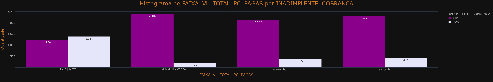

# Probabilidade de Inadimplência

### :brazil: [Versão em Português](https://github.com/FelipeLRoll/previsao-inadimplencia/blob/main/readmePortugues.md)
### Inspirado por: [Default Rate](https://www.youtube.com/watch?v=ey4GZtO_VzE&t=0s)

# Visão Geral do Projeto
  - ## **Motivação:**
  A inadimplência é um problema crítico para as instituições financeiras, pois impacta diretamente o fluxo de caixa e a saúde financeira das empresas. Prever com antecedência quais clientes têm maior probabilidade de inadimplência permite que as empresas adotem estratégias preventivas, minimizando perdas.

 - ## **Objetivos:**

O **principal objetivo** deste projeto é construir um modelo de Machine Learning capaz de prever a inadimplência de clientes com base em um conjunto de dados de contratos de financiamento.

- **Construir um modelo preditivo de inadimplência** usando algoritmos de classificação.
- **Analisar as variáveis mais relevantes** para prever a inadimplência, ajudando a entender os fatores de risco.
- **Avaliar o desempenho dos modelos** usando métricas de desempenho.

- ## **Dicionário de Dados:**
| Coluna | Descrição |
|-------------------------------|----------------------------------------------------|
| **NUMERO_CONTRATO** | Número de identificação do contrato |
| **DATA_ASSINATURA_CONTRATO** | Data em que o contrato foi assinado |
| **TIPO_FINANCIAMENTO** | Tipo de financiamento oferecido |
| **TAXA_AO_ANO** | Taxa de juros anual do contrato |
| **PZ_FINANCIAMENTO** | Prazo de financiamento (em meses) |
| **CIDADE_CLIENTE** | Cidade onde o cliente mora |
| **ESTADO_CLIENTE** | Estado onde o cliente mora |
| **RENDA_MENSAL_CLIENTE** | Renda mensal do cliente |
| **QT_PC_ATRASO** | Número de parcelas em atraso |
| **QT_DIAS_PRIM_PC_ATRASO** | Número de dias da primeira parcela em atraso |
| **QT_TOTAL_PC_PAGAS** | Número total de parcelas pagas |
| **VL_TOTAL_PC_PAGAS** | Valor total das parcelas pagas |
| **QT_PC_PAGAS_EM_DIA** | Número de parcelas pagas em dia |
| **QT_DIAS_MIN_ATRASO** | Menor número de dias em atraso |
| **QT_DIAS_MAX_ATRASO** | Maior quantidade |
| **QT_DIAS_MEDIA_ATRASO** | Média de dias em atraso |
| **VALOR_FINANCIAMENTO** | Valor total do financiamento |
| **VALOR_PARCELA** | Valor de cada parcela |
| **IDADE_DATA_ASSINATURA_CONTRATO** | Idade do cliente na data de assinatura do contrato |
| **INADIMPLENTE_COBRANCA** | Indicador se o cliente está inadimplente |

# Principais Características:
- **Tipo de problema**: *Classificação*
- **Coluna Alvo**: *INADIMPLENTE_COBRANCA*
- **Processo**: Exploração de dados, tratamento, engenharia de atributos, treinamento de modelo, avaliação e ajuste

# Ferramentas e Recursos Utilizados:
- **Ferramentas de Desenvolvimento**: `Jupyter Notebook, Git, GitHub, Visual Studio Code`
- **Gerenciamento de Projeto**: `Poetry`
- **Linguagem de Programação**: `Python ^3.13`
- **Bibliotecas**:
  - `pandas = ^2.2.3`
  - `pypyodbc = ^1.3.6`
  - `python-dotenv = ^1.0.1`
  - `plotly-express = ^0.4.1`
  - `nbformat = ^5.10.4`
  - `kaleido = 0.1.0.post1`
  - `scikit-learn = ^1.5.2`
  - `imbalanced-learn = ^0.12.4`
  - `xgboost = ^2.1.2`
  - `joblib = ^1.4.2`
  - `openpyxl = ^3.1.5`

# Etapas do Projeto:
  * ## Criação de Dados
    - Esta etapa consiste em criar a estrutura do banco de dados para extrair os dados do sistema ERP e inserir os dados em outro banco de dados através de um processo ETL automático. Também criaremos tabelas e procedimentos em nosso banco de dados.

  * ## Carregamento de Dados
    - Usamos a biblioteca **pypyodbc** para conectar ao banco de dados e recuperar os dados.
    
  * ## Análise Exploratória de Dados
     - Aqui analisamos nosso conjunto de dados para entender a estrutura e os padrões. Alguns insights encontrados neste processo:
       
        - Vemos que o conjunto de dados possui **10415 linhas e 20 colunas**;
        - O número médio de parcelas em atraso é muito maior quando o cliente tem uma renda mensal superior a **R$ 5.800**;
        - O valor médio da parcela por renda mensal do cliente é muito maior quando o cliente ganha **R$ 1.800 ou menos**, ou quando o cliente ganha **R$ 6.800 ou mais**;
        - Clientes de **525 cidades diferentes**;
        - Clientes de **todos** os estados do Brasil;
        - A maioria dos clientes neste conjunto de dados está inadimplente (8038 de 10415, ~77%)**;
        - Período dos dados: **2012-01-10 a 2022-11-14**;
        - A maioria dos clientes (**41%**) ganha entre **R$ 6.900 e R$ 7.800 por mês**;
        - **34%** dos clientes ganham até **R$ 1.800**;
        - **75%** dos clientes ganham entre **R$ 6.900 e R$ 7.800 ou até R$ 1.800**;
        - **76%** das parcelas pagas são pagas em dia.

  * ## Tratamento de Dados
    - Esta etapa focou na limpeza e pré-processamento dos dados, também otimizamos as colunas para reduzir o tamanho do conjunto de dados. Esta etapa teve alguns dos seguintes tratamentos:
      
      - Ordenação de algumas colunas para dar uma sensação de maior importância aos diferentes tipos de valores;
      - Remoção de linhas duplicadas;
      - Agrupamento de valores e criação de intervalos para reduzir a cardinalidade;
      - Remoção de algumas colunas não relevantes para a análise.

    - Nesta etapa também tivemos alguns insights adicionais:
     
      - A mediana da **Taxa Anual** é **17,27%**.
      - O **Prazo Médio de Financiamento** é **114** enquanto a mediana é **72**. O salto de 25% dos dados para 50% dos dados não existe, mas de 50% para 75% vai de **72** para **180**. O desvio padrão também é alto, o que indica uma maior dispersão dos dados.
      - Algo semelhante ocorre com as outras colunas do conjunto de dados, onde a maioria dos valores está concentrada em um pequeno intervalo de valores.
      - A maioria dos clientes é de **Brasília**.
      - O intervalo do **Valor Total das Parcelas Pagas** que mais aparece é de **R$ 8.676 a R$ 25.000**.
      - O intervalo do **Valor do Financiamento** que mais aparece é de **Até R$ 210.000**.
      - O intervalo do **Valor da Parcela** que mais aparece é de **Até R$ 2.500**.

  * ## Visualização com *Plotly Express*
    - Aqui foram feitos muitos gráficos para visualizar melhor nossos dados e ajudar a entendê-los melhor.
   
    ### **Distribuição de Clientes por Renda**
    
    
    - A maior concentração de clientes está na faixa de **R$ 7.800**, seguida por **R$ 1.800**.

    ### **Distribuição da Faixa Etária por Renda**

    
    - A maior renda média mensal está entre **0-24 anos**.

    ### **Número Médio de Dias em Atraso por Faixa de Financiamento**
    
    
    - Aqui podemos ver qual faixa de valor do empréstimo tende a ter a maior média de atrasos, neste caso a faixa de até R$ 210.000 tem a maior média.
   
    ### **Faixa Etária na Assinatura do Contrato por Prazo de Financiamento**

    
    - Entre **0-24 anos** há uma densidade visível em torno de prazos de 50 a 100 meses, sugerindo que, embora alguns tenham prazos longos, a maioria dos clientes se concentra em prazos médios de financiamento.
    
    - Clientes com idade **acima de 25 anos** têm uma densidade concentrada entre 50 e 100 meses, com muito menos variabilidade em comparação com os grupos de idade de **0-24 anos**.
    
    - No grupo de **25+ anos** há menos outliers, o que indica menos casos extremos de financiamentos muito longos ou curtos.
    
    - Para o grupo de **65+ anos**, a distribuição do prazo de financiamento é ainda mais estreita e mais centrada, o que pode indicar que clientes mais velhos têm opções de financiamento mais previsíveis ou são mais cautelosos ao escolher prazos mais curtos.
    
    - À medida que a idade aumenta, os prazos de financiamento tornam-se mais padronizados e centrados entre **50 e 100 meses**.
   
    ### **Distribuição dos Atrasos Máximos por Renda**

    
    - Para a maioria das faixas de renda, há uma grande variação nos atrasos. Os atrasos variam de **0 a mais de 3000 dias**.

    - A maioria dos clientes em todas as faixas de renda tende a ter atrasos mais curtos, próximos de **0 dias**. Isso significa que, embora alguns clientes tenham longos atrasos, a maioria consegue manter atrasos mais curtos.
    
    - Algumas faixas de renda têm caudas mais longas, atingindo atrasos extremos de mais de **5000 dias**.
    
    - Existem alguns outliers espalhados por todas as faixas de renda, com alguns casos extremos de atrasos muito além do que a maioria dos clientes experimenta.
   
- Alguns outros insights encontrados nos outros gráficos presentes neste projeto:
  
    - Empréstimos **de até R$ 210.000** estão concentrados nos valores de parcelas mais baixos **(menos de R$ 2.500)**.
      
    - Empréstimos **de R$ 210.000 a R$ 290.000** mostram maior variabilidade nos valores das parcelas, com uma caixa e *bigodes* mais largos, indicando maior dispersão nos valores das parcelas.
      
    - Empréstimos **de R$ 290.000 a R$ 400.000** têm a maioria dos valores das parcelas **de até R$ 5.000**, com alguns ultrapassando esse intervalo.
      
    - O gráfico mostra ainda mais variabilidade nas parcelas, com valores medianos mais altos. Também há alguns outliers, mas a faixa de pagamentos aqui se estende a valores de parcelas mais altos.
      
    - À medida que o **valor do financiamento aumenta**, as **parcelas mensais tendem a aumentar**, e a dispersão dos valores também se torna maior.
      
    - A média da **taxa de juros** aumenta à medida que o **valor do financiamento** aumenta.
      
    - Para o período de financiamento de **48 meses**, a taxa de juros média é a mais alta, em torno de **20% ao ano**.
      
    - Para prazos de **160 a 194 meses**, a taxa de juros média cai um pouco, para cerca de **14-17% ao ano**. Esses prazos intermediários parecem ser os mais favoráveis em termos de taxas de juros.
      
    - Prazos mais longos, **entre 200 e 240 meses**, veem as taxas subirem novamente, atingindo **20%**.
      
    - Prazos mais curtos ou muito longos estão associados a taxas de juros mais altas, enquanto prazos intermediários oferecem as melhores condições.
    
    - A maioria dos clientes está nos estados de **São Paulo, Goiás e Distrito Federal**.
    
    - 31,7% das parcelas estão em atraso, com um total de 173.754 parcelas.
      
    - Esse número parece bastante alto quando comparado aos dados de 2021 no Brasil, no financiamento imobiliário, que atingiu 20%.
    
    **FONTE:**
    
    **Fundos Ampliam Compra de Créditos Imobiliários em Atraso no Brasil**
    
    https://www.infomoney.com.br/onde-investir/fundos-ampliam-compra-de-credito-imobiliario-em-atraso-no-brasil/
    
    Data de acesso: 22/10/2024
        
* ## Análise Exploratória de Dados com Colunas Categóricas
  
    - Aqui analisamos mais de perto as Colunas Categóricas, criando histogramas para visualizar padrões e como se comportam.

    ### **Colunas Categóricas por Inadimplência**
  
    

    

    

- Alguns insights encontrados nos outros gráficos:
  
  - Localização

    - **Distribuição de valores**: A maioria dos clientes está em Brasília, Goiânia e São Paulo.
    * **Inadimplência**: Existem poucos lugares onde o número de inadimplentes é menor do que o de não inadimplentes, geralmente em **pequenas cidades** com poucos casos disponíveis.

  - Faixa etária
      
      * **Distribuição dos casos**: A maioria dos casos está na faixa etária de **25-54 anos** na data de assinatura do contrato.
      * **Inadimplência**: **Todas as faixas** têm mais inadimplentes do que o contrário.
      
  - Total de Parcelas Pagas
      
      * **Faixa mais comum**: Quando o total de parcelas pagas é superior a R$ 47.000, vemos uma maior concentração de clientes.
      * **Tendência de Inadimplência**: Até **R$ 8.675** o número de inadimplentes é **menor** do que o de não inadimplentes, à medida que o valor **aumenta**, **a proporção de inadimplentes cresce**.
      
  - Valor do financiamento
      
       * **Distribuição do financiamento**: Os valores do financiamento estão bem distribuídos, com maior concentração na faixa mais baixa de **até R$ 210.000**.
       * **Comparação de Inadimplência**: Quanto **maior o financiamento**, **maior a proporção de inadimplentes**.
       
  - Valor das parcelas
      
       * **Distribuição da parcela**: A faixa com maior concentração é **até R$ 2.500**.
       * **Comparação de Inadimplência**: Os valores mais extremos de **até R$ 2.500** e **acima de R$ 5.000** têm uma **proporção menor** de não inadimplentes, com uma **maior proporção** na faixa intermediária.
      
  - Número de inadimplentes
      
       * Inadimplência: Cerca de 80% dos clientes estão inadimplentes.
         
 * ## Análise Exploratória de Dados com Colunas Numéricas
   
    - O objetivo aqui é observar a correlação entre as Colunas Numéricas e a Coluna Alvo.
      
   ### **Colunas Numéricas por Inadimplência**

    

    

    

- Alguns insights encontrados nos outros gráficos:
  
  - Renda Mensal

    * **Distribuição de renda**: A maioria dos clientes está na faixa de **até R$ 1.800** e **R$ 6.000 a R$ 8.000**.
    * **Taxas de inadimplência**: Em todas as faixas de renda, o número de inadimplentes excede o número de não inadimplentes.
    * **Tendência de inadimplência**: Clientes com renda mensal de **até R$ 4.000** têm uma tendência significativamente maior de inadimplência em comparação com aqueles de faixas de renda mais altas.

  - Taxa Anual

    * **Distribuição da taxa anual**: A maioria dos clientes paga uma taxa anual dentro da faixa de **15-20%**, tornando essa faixa a mais importante para análise.
    * **Taxas de inadimplência por taxa anual**: Em todas as faixas de taxa anual, o número de inadimplentes excede o de não inadimplentes.

  - Prazo de Financiamento

    * **Prazo de financiamento mais comum**: O prazo de financiamento mais comum é de **50-99 dias**.
    * **Tendência de inadimplência**: Há uma tendência onde, **após 99 dias de financiamento, a diferença entre clientes inadimplentes e não inadimplentes aumenta**.

  - Atrasos

    * **Distribuição de atrasos**: Em todos os gráficos relacionados a atrasos, a concentração de clientes está no **primeiro intervalo** e **diminui gradualmente** à medida que os intervalos progridem.
    * **Comparação de inadimplência**: Com algumas exceções, principalmente nos Dias de Primeiro Atraso, o número de clientes inadimplentes é sempre maior do que o número de clientes não inadimplentes.

   ### **Correlação**

   

	 * **Prazo de Financiamento e Parcelas Pagas**: O prazo de financiamento mostra uma correlação positiva média com:
		  + Total de Parcelas Pagas
		  + Parcelas pagas em dia
  
   * **Parcelas como Fator de Correlação**: A maioria das correlações fortes ocorre através das colunas envolvendo as **parcelas**.

	 * **Renda Mensal e Pagamento de Parcelas**: A renda mensal do cliente também mostra uma correlação média com:
		  + Total de Parcelas Pagas
		  + Parcelas Pagas em Dia

   * **Taxa Anual e Prazo de Financiamento**: A taxa percentual anual tem uma correlação média com:
  		+ Prazo de Financiamento
  		
   * **Correlação negativa entre atrasos e pagamentos**: Há uma forte correlação negativa entre:
  		+ Número de Parcelas Atrasadas
  		+ Número de Dias do Primeiro Atraso de Parcela
  		e:
  		+ Total de Parcelas Pagas
  		+ Parcelas pagas em dia
  
 * ## OneHotEncoding

   - Aqui separamos nossas colunas numéricas, categóricas e alvo para usar **LabelEncoder**, já que temos alta cardinalidade em algumas colunas.

 * ## Balanceamento da Coluna Alvo
   
    - Esta etapa divide os dados na Coluna Alvo e no restante do conjunto de dados, criando dois conjuntos de dados para balancear a Coluna Alvo usando *SMOTE*, isso ajuda o modelo de machine learning a não ser tendencioso para um dos possíveis resultados.

    

 * ## Escalonamento dos dados 
    - Aqui testamos a Padronização e o *RobustScaler* para colocar nossos valores numéricos na mesma escala e não criar um viés para o nosso modelo. Após testar todos os métodos, optamos por usar a *Padronização* porque teve os melhores resultados. Também dividimos os dados em *treino* e *teste*.
  
 * ## Criação do Modelo, Ajuste de Hiperparâmetros, Treinamento e Avaliação
   - Esta etapa cria nossos Modelos de Machine Learning que serão treinados com nossos dados, os hiperparâmetros também são atribuídos manualmente aqui. Os modelos utilizados são *Random Forest Classifier*, *Support Vector Machine*, *K Neighbors Classifier*, *XGBoost* e *Logistic Regression*. Testamos a **Precisão**, **Melhores Hiperparâmetros**, **Tempo de Treinamento (em segundos)** e **Número Total de Treinamentos Feitos** para cada um de nossos modelos, tendo *XGBoost* como o melhor modelo com uma precisão de ~92.00%.
  
# Resultados:
Os resultados previstos podem ser encontrados em **`excel/resultado.xlsx`**.  

- **Random Forest**:
  
  
  
- **SVM**:
  
  

- **KNN**:
  
  

- **XGBoost**:
  
    

- **Logistic Regression**:
  
  

- **Resultados Gerais**:
  
  

- **Importância das Variáveis**:
  
  

- **Modelo Final (XGBoost com os melhores Hiperparâmetros)**
   
  

- Métricas:
  
  - **Precisão: 92.62%:** Aproximadamente **92%** das previsões feitas pelo modelo estão corretas.

  - **Precisão: 0.93:** De todas as previsões que o modelo identificou como positivas, 92% eram realmente positivas. Uma **alta precisão** indica uma **baixa taxa** de falsos positivos.
  
  - **Recall: 0.92:** De todos os casos positivos reais, o modelo identificou corretamente **92%** deles. Um recall alto significa uma **baixa taxa** de falsos negativos.
  
  - **F1 Score: 0.92:** A média harmônica de precisão e recall. Um F1 Score alto indica um **bom equilíbrio** entre precisão e recall.
  
  - **Matriz de Confusão:** 
      - **Verdadeiros Negativos (2241):** Casos negativos identificados corretamente.
      - **Falsos Positivos (189):** Casos positivos identificados incorretamente.
      - **Falsos Negativos (197):** Casos negativos identificados incorretamente.
      - **Verdadeiros Positivos (2194):** Casos positivos identificados corretamente. Isso mostra que tanto os falsos positivos quanto os falsos negativos são **relativamente baixos**, indicando **bom desempenho**.
      
  - **ROC AUC Score: 0.92:** Área sob a curva ROC. Um score de **0.92** indica que o modelo faz um **bom trabalho** ao distinguir entre classes positivas e negativas.

  - **Classificação:**
    - **Classe 0 e Classe 1:** Ambas as classes têm alta precisão, recall e F1 scores, mostrando desempenho equilibrado em diferentes categorias.
    - **Média Macro:** Média de precisão, recall e F1 scores igualmente entre as classes.
    - **Média Ponderada:** Leva em consideração o desequilíbrio das classes ao calcular a média de precisão, recall e F1 scores.
   
# ANÁLISE PRESCRITIVA

Algumas medidas podem ser tomadas para minimizar o número de clientes inadimplentes:

1. **Segmentação de Clientes**

    - Usar algoritmos de clustering para agrupar clientes com base em fatores de risco (por exemplo, renda, histórico de crédito, comportamento de pagamento) pode ajudar a personalizar intervenções, como oferecer planos de pagamento flexíveis ou taxas de juros ajustadas para grupos de alto risco.
    - Para esses clientes, seria interessante construir um sistema de alerta que seja ativado quando eles mostrarem sinais iniciais de dificuldades financeiras, como pagamentos atrasados.

2. **Análise Comportamental e Temporal**

    - Outra alternativa seria analisar históricos de pagamento ao longo do tempo para detectar tendências. Identificar esses padrões pode ajudar a planejar intervenções, como lembretes direcionados durante períodos de maior risco.

3. **Ajustes de Políticas Baseados em Perfis de Risco**

    - Para contratos com alta probabilidade de inadimplência prevista, políticas poderiam ser definidas, como taxas de financiamento mais baixas, prazos de empréstimo mais curtos ou um processo de aprovação mais rigoroso.
    - Oferecer preços baseados em diferentes grupos de clientes, ajustando as taxas de juros com base na probabilidade de inadimplência.      

4. **Programas de Educação e Engajamento do Cliente**

    - Programas para educar os clientes sobre gestão financeira e orçamento podem ser uma boa alternativa, especialmente para aqueles em segmentos de alto risco. Isso pode reduzir o risco de inadimplência melhorando a tomada de decisões financeiras.
    - Lembretes e dicas via notificações ou e-mails para incentivar pagamentos pontuais.

# Conclusão

Neste projeto, uma análise foi desenvolvida para **prever a probabilidade de inadimplência de clientes** com base em um conjunto de dados de empréstimos. As principais etapas do projeto incluíram:

1. **Engenharia de Atributos e Preparação de Dados**: Realizamos um pré-processamento completo dos dados, incluindo a criação de novas variáveis e o **balanceamento da variável alvo** para garantir melhor desempenho do modelo.

2. **Análise Exploratória de Dados (EDA)**: Utilizamos visualizações e estatísticas descritivas para **identificar padrões e entender a distribuição das variáveis**, o que ajudou a guiar as etapas de modelagem subsequentes.

3. **Modelagem**: Diferentes **algoritmos de classificação** foram testados, e os resultados de cada modelo foram avaliados quanto à **precisão**. O modelo que apresentou melhor desempenho foi o **XGBoost**, alcançando uma precisão de aproximadamente **92%** e um F1-score de **0.92**.

4. **Interpretabilidade**: Utilizamos valores **SHAP** para interpretar as previsões do modelo final, identificando as **variáveis** mais influentes para a probabilidade de inadimplência (**PZ_FINANCING**, **QT_PC_DELIENT**, **QT_DAYS_PRIM_PC_DELIENT**).

O modelo final foi capaz de identificar com precisão os clientes com maior probabilidade de inadimplência, destacando variáveis-chave como **PZ_FINANCIAMENTO**, **QT_PC_ATRASO**, **RENDA_MENSAL_CLIENTE**, **QT_DIAS_PRIM_PC_ATRASO**. Este modelo pode ser aplicado para ajudar instituições financeiras a reduzir o risco identificando possíveis inadimplentes e permitindo ações preventivas.

Em conclusão, o projeto forneceu uma solução eficiente para prever inadimplências, com alto potencial de aplicação prática para melhorar a gestão de riscos e a tomada de decisões no setor financeiro.
  
  
# Como usar  

Este projeto precisa das mesmas tabelas, banco de dados, usuário, senha encontrados no servidor SQL utilizado para conectar aos dados, portanto, você não conseguirá reproduzir todas as etapas a menos que siga o vídeo vinculado no início deste readme.

  * Configure um ambiente virtual usando o Poetry:
     - Execute `poetry install` para instalar as dependências
  
  * Para fazer previsões em um novo conjunto de dados:
     - Execute `previsao-inadimplencia.ipynb` para passar por todas as etapas do projeto e treinar o modelo (pode ser necessário descomentar muitas partes do projeto)
     - Use `gerar_previsao.py` para carregar um novo conjunto de dados e prever resultados

# Desenvolvido por: 

  * [Felipe Roll - Linkedin](https://www.linkedin.com/in/felipe-roll)
  * [Felipe Roll - Github](https://github.com/FelipeLRoll)
  * [Felipe Roll - Gmail](felipelroll@gmail.com)
